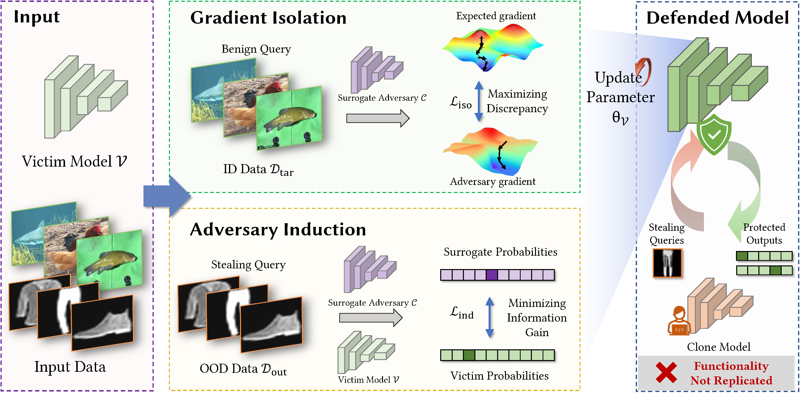

# Isolation and Induction: Training Robust Deep Neural Networks against Model Stealing Attacks



## Introduction

This repository is the official PyTorch implementation of paper "[Isolation and Induction: Training Robust Deep Neural Networks against Model Stealing Attacks]()"

## Install

### Requirements

* Python >= 3.6
* PyTorch >= 1.8

### Data Preparation

This code supports following datasets:

* MNIST
* KMNIST
* EMNIST
* EMNISTLetters
* FashionMNIST
* CIFAR-10
* CIFAR-100
* SVHN
* Tiny ImageNet

Please download datasets from their official website, and put them in `data/` directory.

If you want to customize your own datasets, please refer to `src/datasets/__init__.py`.

## Usage

First you should generate an YAML file as the config of an experiment. 

```bash
python yaml_all.py --path <exp_path> --defense [nd|ini] --attack [knockoff|jbda]
```

This will generate a `config.yaml` file at `exp_path`. You can manually modify the YAML file, or use commands to assign more parameters.

Then, you can run the experiments by running `defense_entry.py` and `attack_entry.py`. `defense_entry.py` is to train a defended model, and `attack_entry.py` is to perform model stealing attacks.

```bash
python defense_entry.py --config <exp_path>
python attack_entry.py --config <exp_path>
```

All results and checkpoints will save under <exp_path>.


## Citation

If this work helps your research, please cite the following paper.

```
@inproceedings{guo2023isolation,
  title={Isolation and Induction: Training Robust Deep Neural Networks against Model Stealing Attacks},
  author={Guo, Jun and Liu, Aishan and Zheng, Xingyu and Liang, Siyuan and Xiao, Yisong and Wu, Yichao and Liu, Xianglong},
  booktitle={Proceedings of the 31th ACM International Conference on Multimedia},
  year={2023}
}
```
